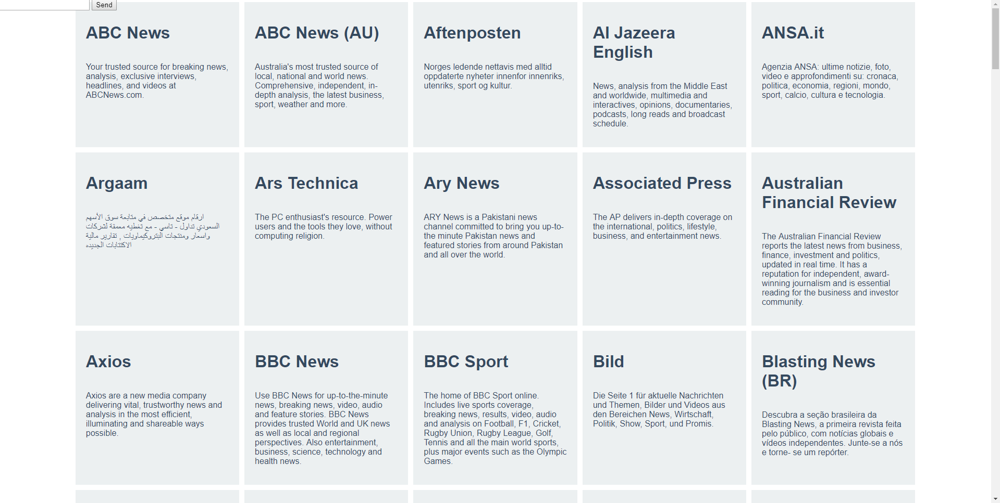
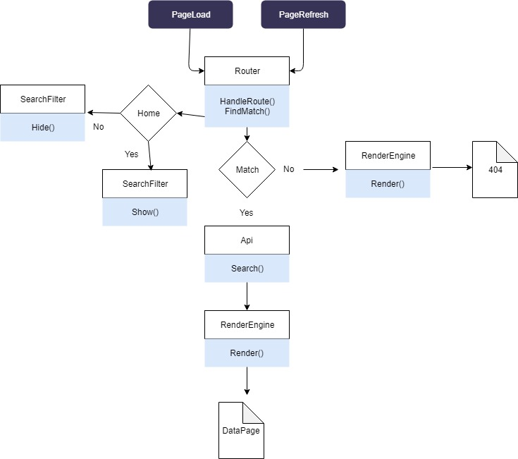

# WAFS


## Demo
[Here](https://zekkie.github.io/web-app-from-scratch-18-19/)


## API
 I'm using the api of the newsapi. Funny enough that is the actual name of the api. 
 [Can be found here](https://newsapi.org)

### Type 
Rest

### Ratelimit
1000 calls per day

### Enpoints used

/source
/everything

## App discription

The is basicly a news reader where users can read newsarticles from different papers. 


## Challeges

During this project, I want to write all of the code myself. I do not want to use third party code. Knowing my code might be buggy, it will be a fun learning experience due to the problems I might face.

## Actor Diagram


## Actor Diagram


		

## Custom render engine 
```javascript

import EasyRequest from './easyrequest.js';

class RenderEngine extends EasyRequest{

	constructor() {
		super();
	  this.template = '';
	  this.data = [];
	  this.documentTarget = document.getElementById("view");
	  this.dir = "./templates/"
	  this.templateRoute = "";
	};

	magicReplacer(text, d) {
		const regex = new RegExp('\{(.*?)\}')
		let stripedTemplate = text;
		while(regex.test(stripedTemplate)) {
			let found = stripedTemplate.match(regex);
			stripedTemplate = stripedTemplate.replace(found[0], d[found[1]]? d[found[1]] : "" );
		};
		return stripedTemplate;
	};


	buildDataRoute(data,template) {
		let tempStr = '';
		data.forEach((d) => {
			tempStr += this.magicReplacer(template, d);
		});
		this.documentTarget.innerHTML = tempStr;
	}

	buildRoute(template) {
		this.documentTarget.innerHTML = template;
	};

	buildDom(template) {
		if(this.data) {
			this.buildDataRoute(this.data,template);
		}else {
			this.buildRoute(template);
		}
	}

	setTemplate(temp) {
		this.templateRoute = this.dir + temp;
		return this;
	} 

	render(data,cb) {
		super.open("GET",this.templateRoute,true);
		super.send();
		this.data = data;
		this.then((res) => {
			this.buildDom(res);
			cb();
		});
	};
};

export default RenderEngine;

```

### Workings

The engine fetches an html template trough a XMLHTTPRequest and then replaces the handlebars inside the template with the corresponding data attribute. And that gets put into the view. 
An html template looks like this:

```html
<section>
	<div class="content">
		<h1>{title}</h1>
		
		<p>{content}</p>
	</div>
	<a href={url} about="_blank">Read More</a>
</section>

```

## Custom routing

```javascript
import RenderEngine from "./renderengine.js";
import ApiCaller from "./apicaller.js";
import Filter from "./SearchFilter.js";
const renderer = new RenderEngine();
const api = new ApiCaller();
const filter = new Filter();

class Router{
	constructor(initial) {	
	  this.routes = [];
	  this.initialRoute = initial;
	  this.loadInterval = null;
	  if(!window.location.hash){
	  	window.location.hash = this.initialRoute;
	  };
	  window.onload = () => {
	  	this.handleRoute();
	  	this.hashChange = window.addEventListener("hashchange",this.handleRoute.bind(this),true);
	  };
	};
	hash() {
		return window.location.hash.substr(1);
	};
	handleRoute(e) {
		this.showLoader();
		if(e) {
			this.eventFired = true;
		}

		if(window.location.hash !== "#home") {
			filter.destroy();
			filter.hide();
		}else if(window.location.hash === "#home") {
			filter.show();
		}
		const param = this.hash();	
		this.findMatch(param);
	};

	showLoader() {
		if(!document.querySelector("#loader")) {
			document.querySelector("#view").innerHTML = `
				<div id="loader">
					<h1>
						Loading.
					</h1>
					<p id="loading-message"></p>
				</div>
			`;
		}
		this.loadInterval = setTimeout( function(){
				const loadingBox = document.querySelector("#loading-message");
				if(loadingBox) {
					loadingBox.innerText = "Loading takes too long, might want to come back later <3.."
				};
			},3000);
	}

	findMatch(hash) {
		const keys = hash.split("/")
		const dir = keys[0];
		const id = keys[1];
		let route = this.routes.find((i) => {
			return i.route === dir;
		})
		if(!route) {
			route = this.routes.find((i) => {
				return i.route === "*";
			});
			renderer
				.setTemplate(route.template)
				.render();
		}else {
			api.search(route.endpoint,route.filter,id)
				.then(i => {
				clearTimeout(this.loadInterval);
				renderer
					.setTemplate(route.template)
					.render(i,function() {
						filter.init();
					});
					
			});
		};
	};
	route(route) {
		if(typeof route != "object") {
			console.error("Type of input is "+typeof route+". Expected an object");
		}else {
			this.routes.push(route);
		}
		return this;
	}
};

export default Router;

```

### Workings

The router both works on a hashchange event and a page refresh. The user could define a route with the .route() method that accepts an object with route,template,filter and endpoint as attributes. 

## Why classes

Even though classes aren't always justified, classed for me keeps my code logical and organized. That way I can easily modify files where needed, and keep the lines of code per file small. 


## What did I learn

During WAFS I've learned to work in a modular fashion. Where my code is divided in multiple files and for that reason is easily maintainable. Before, I kind of did that but not like the way I did now. 