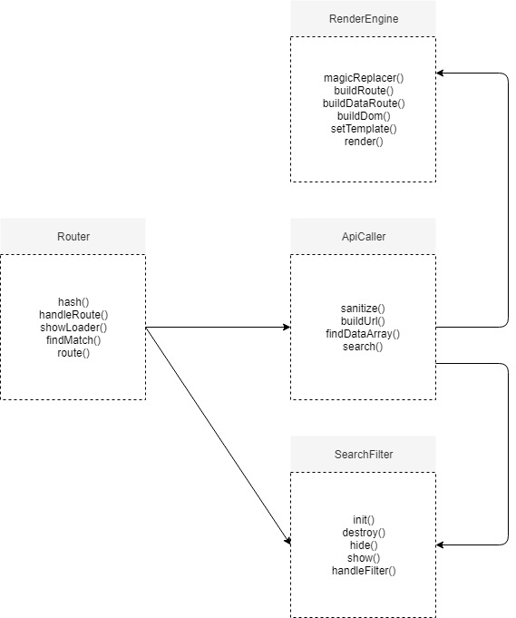

# WAFS


## Demo
[Here](https://zekkie.github.io/web-app-from-scratch-18-19/)


## API
 I'm using the api of the newsapi. Funny enough that is the actual name of the api. 
 [Can be found here](https://newsapi.org)

### Type 
Rest

### Ratelimit
1000 calls per day

### Enpoints used

/source
/everything

## App discription

The is basicly a news reader where users can read newsarticles from different papers. 


## Actor Diagram



## Actor Diagram


		

## Custom render engine 
```javascript


'use-strict'

import EasyRequest from './easyrequest.js';

class RenderEngine extends EasyRequest{

	constructor() {
		super('./templates/home.html');
	  this.template = '';
	  this.data = [];
	  this.documentTarget = document.body;
	};

	magicReplacer(text, d) {
		const regex = new RegExp('\{(.*?)\}')
		let stripedTemplate = text;
		while(regex.test(stripedTemplate)) {
			let found = stripedTemplate.match(regex);
			stripedTemplate = stripedTemplate.replace(found[0], d[found[1]]);
		};
		return stripedTemplate;
	};


	buildDom(template) {
		let tempStr = '';
		this.data.forEach((d) => {
			tempStr += this.magicReplacer(template, d);
		});
		document.body.insertAdjacentHTML('afterbegin',tempStr);
	}

	render() {
		this.then((res) => {
			this.buildDom(res);
			console.log(this)
		});
	};
};

export default RenderEngine;

```

### Workings

The engine fetches an html template trough a XMLHTTPRequest and then replaces the handlebars inside the template with the corresponding data attribute. And that gets put into the view. 
An html template looks like this:

```html
<section>
	<div class="content">
		<h1>{title}</h1>
		
		<p>{content}</p>
	</div>
	<a href={url} about="_blank">Read More</a>
</section>

```

## Why classes

My motivation for the use of classes is, I always try to build my code in a way so it is modular and serves multiple usecases. Using classes in my opinion helps with this.


## Class extensions

```javascript
class RenderEngine extends EasyRequest{

```
